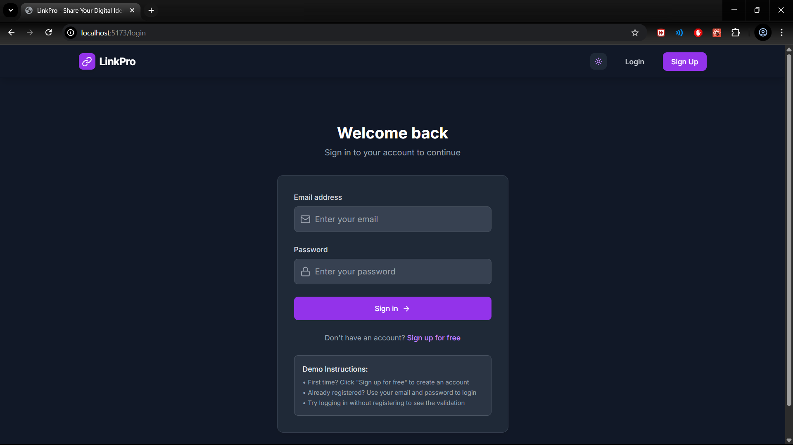

# LinkPro

LinkPro is a modern web application that allows users to create, manage, and share a single, customizable link that aggregates all their social profiles, content, and contact information. It is designed for creators, professionals, and anyone who wants to manage their digital presence with ease.

## Features

- **Smart Links:** Create beautiful, branded links that redirect to your social and professional profiles with custom URLs.
- **Dashboard:** Manage your links, view analytics, and track engagement in a user-friendly dashboard.
- **Analytics:** Track clicks, analyze trends, and understand which platforms drive engagement.
- **Discovery/Search:** Find and explore other creators' profiles with powerful search features.
- **Authentication:** Secure sign-up and login system with protected routes for authenticated users.
- **Redirection:** Share a single link (e.g., `/username/platform`) that redirects to the appropriate profile and logs the click for analytics.
- **Modern UI:** Responsive design with light/dark mode support.

## Screenshots

### Login Page


### Login Page (Alternative)


### Home Page


### Dashboard


### Add Link Modal


### Add Link Modal 


### Analytics Graph


### Search Page


## Getting Started

### Prerequisites
- Node.js (v16 or higher recommended)
- npm (comes with Node.js)

### Installation
1. Clone the repository:
   ```bash
   git clone <your-repo-url>
   cd LinkPro
   ```
2. Install dependencies:
   ```bash
   npm install
   ```
3. Start the development server:
   ```bash
   npm run dev
   ```
4. Open your browser and visit [http://localhost:5173](http://localhost:5173) (or the port shown in your terminal).

## Project Structure

- `src/` - Main source code
  - `components/` - Reusable UI components
  - `context/` - React context for authentication and theme
  - `pages/` - Main pages (Home, Dashboard, Redirect, etc.)
  - `utils/` - Utility functions (platforms, storage, etc.)
  - `types/` - TypeScript type definitions
- `public/` - Static assets

## Contributing
Pull requests are welcome! For major changes, please open an issue first to discuss what you would like to change.

## License
[MIT](LICENSE)

---

**LinkPro** — One link for everything. 